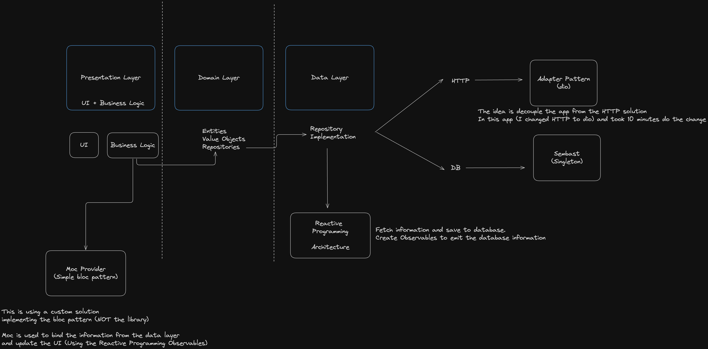

# Movie App Clean Architecture

## Getting Started

To run the project, you need to following the next steps:

- Clone the project
- Run `flutter pub get`
- Have a API key from [TMDB](https://www.themoviedb.org/documentation/api)
- Create a file named `.env`, use the `.env.template` as a example
- Run `dart run build_runner build -d`
- Run `flutter run`

## Architecture: 
 

##### This project is based on Clean Architecture, using the following layers:

- Domain
- Data
- Presentation

Also, is using SOLID principles (Take care to think all files/components are using all SOLID for each component); some principles are more evident in some layers or in some components.

##### Another important thing part of the architecture is:
- Core (shared code and base classes)

##### Important design patterns used:
- Repository
- Singleton
- Adapter

##### Reactive programming:

The app is using reactive programming, to enable couple feature like Offline first, and use Streams(Observables) to handle data.

With this the app depends of one source of truth, the database, and the API, so, if the app is offline, it will use the data from the database, and if the app is online, it will use the data database first and from the API when the user needs to see more information. 

## VIDEO

You can check the screencast usign the file called: screenrecording.mov

## Screenshots

 

 

  
