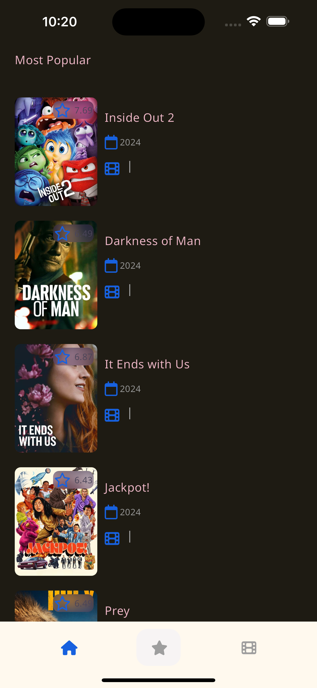
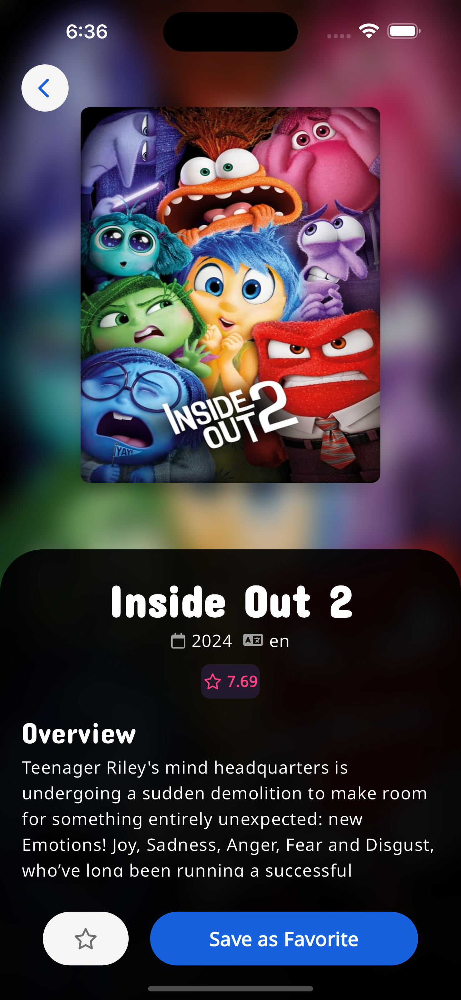
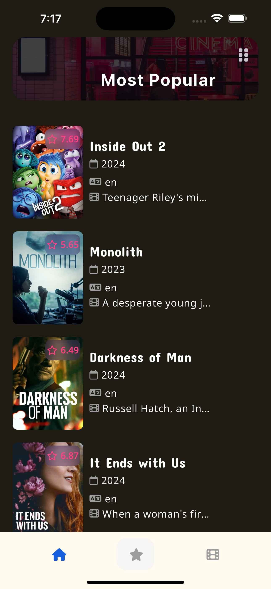

# Movie App Clean Architecture

## Getting Started

To run the project, you need to following the next steps:

- Clone the project
- Run `flutter pub get`
- Have a API key from [TMDB](https://www.themoviedb.org/documentation/api)
- Create a file named `.env`, use the `.env.template` as a example
- Run `dart run build_runner build -d`
- Run `flutter run`

## VIDEO

You can check the screencast usign the file called: screenrecording.mov

## Screenshots

 

 

  
